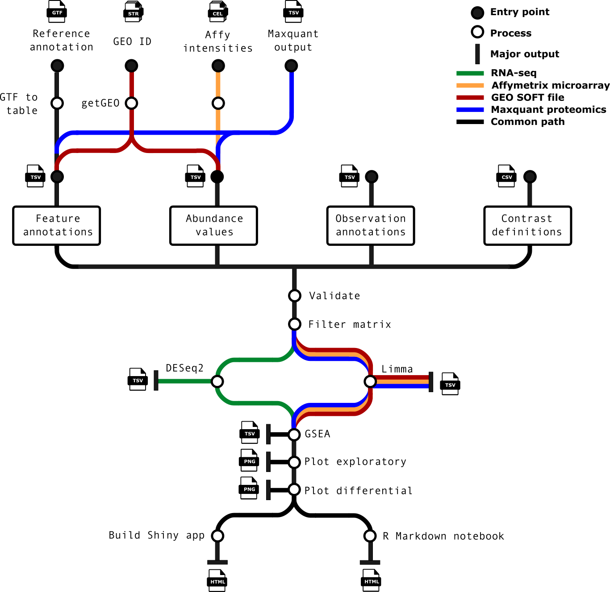
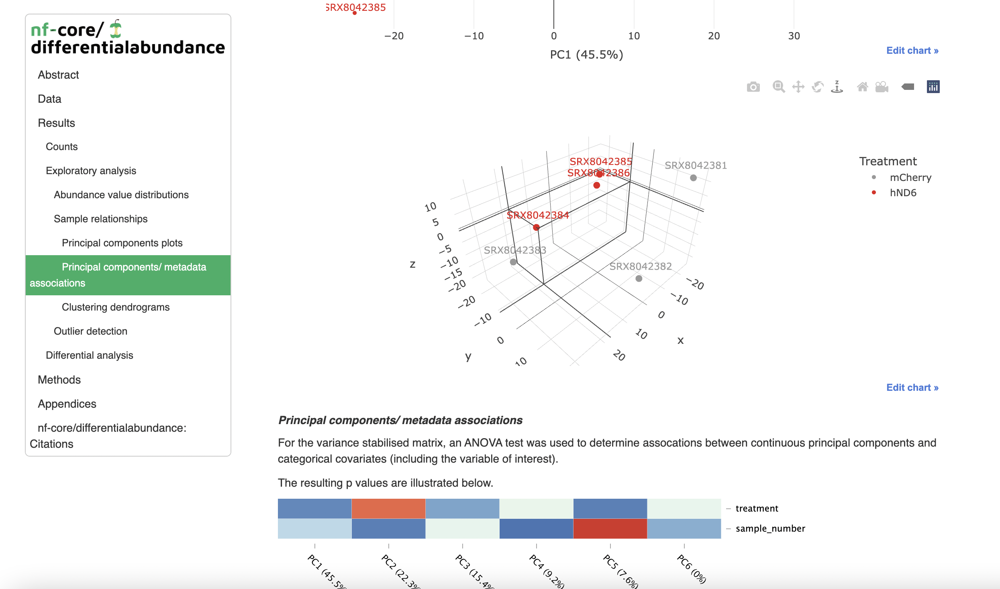
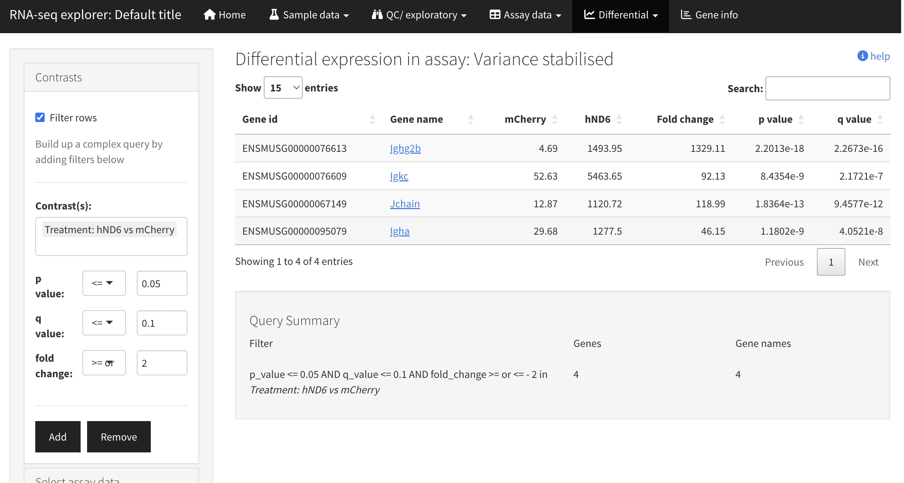
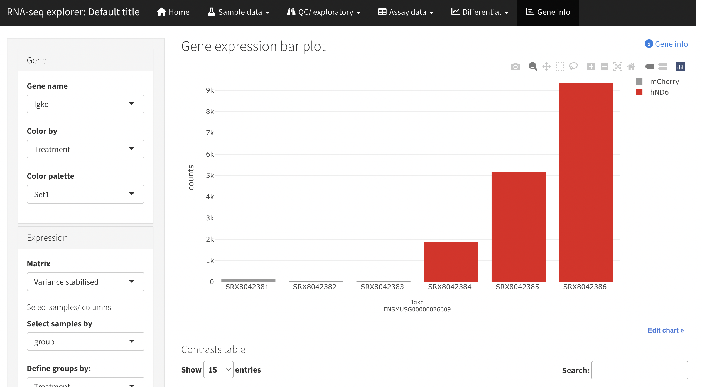

<h1>
  <picture>
    <source media="(prefers-color-scheme: dark)" srcset="docs/images/nf-core-differentialabundance_logo_dark.png">
    
  </picture>
</h1>

[](https://github.com/codespaces/new/nf-core/differentialabundance)
[](https://github.com/nf-core/differentialabundance/actions/workflows/nf-test.yml)
[](https://github.com/nf-core/differentialabundance/actions/workflows/linting.yml)[](https://nf-co.re/differentialabundance/results)[](https://doi.org/10.5281/zenodo.XXXXXXX)
[](https://www.nf-test.com)
[](https://doi.org/10.5281/zenodo.7568000)
[](https://www.nextflow.io/)
[](https://github.com/nf-core/tools/releases/tag/3.5.1)
[](https://docs.conda.io/en/latest/)
[](https://www.docker.com/)
[](https://sylabs.io/docs/)
[](https://cloud.seqera.io/launch?pipeline=https://github.com/nf-core/differentialabundance)

[](https://nfcore.slack.com/channels/differentialabundance)[](https://bsky.app/profile/nf-co.re)[](https://mstdn.science/@nf_core)[](https://www.youtube.com/c/nf-core)

## Introduction

**nf-core/differentialabundance** is a bioinformatics pipeline that can be used to analyse data represented as matrices, comparing groups of observations to generate differential statistics and downstream analyses. The pipeline supports RNA-seq data such as that generated by the nf-core [rnaseq workflow](https://github.com/nf-core/rnaseq), and Affymetrix arrays via .CEL files. Other types of matrix may also work with appropriate changes to parameters, and PRs to support additional specific modalities are welcomed.

The pipeline is built using [Nextflow](https://www.nextflow.io), a workflow tool to run tasks across multiple compute infrastructures in a very portable manner. It uses Docker/Singularity containers making installation trivial and results highly reproducible. The [Nextflow DSL2](https://www.nextflow.io/docs/latest/dsl2.html) implementation of this pipeline uses one container per process which makes it much easier to maintain and update software dependencies. Where possible, these processes have been submitted to and installed from [nf-core/modules](https://github.com/nf-core/modules) in order to make them available to all nf-core pipelines, and to everyone within the Nextflow community!

On release, automated continuous integration tests run the pipeline on a full-sized dataset on the AWS cloud infrastructure. This ensures that the pipeline runs on AWS, has sensible resource allocation defaults set to run on real-world datasets, and permits the persistent storage of results to benchmark between pipeline releases and other analysis sources. The results obtained from the full-sized test can be viewed on the [nf-core website](https://nf-co.re/differentialabundance/results).

## Pipeline summary



1. Optionally generate a list of genomic feature annotations using the input GTF file (if a table is not explicitly supplied).
2. Cross-check matrices, sample annotations, feature set and contrasts to ensure consistency.
3. Run differential analysis over all contrasts specified.
4. Optionally run a differential gene set analysis.
5. Generate exploratory and differential analysis plots for interpretation.
6. Run immunedeconv to estimate immune cell fractions using established deconvolution methods.
7. Optionally build and (if specified) deploy a Shiny app for fully interactive mining of results.
8. Build an HTML report based on Quarto markdown, with interactive plots (where possible) and tables.

> [!NOTE]
> Each of these steps can be looped over multiple parameter sets, through paramsheet files and the `--paramset_name` parameter. See the [usage documentation](https://nf-co.re/differentialabundance/usage) for more information.

## Usage

> [!NOTE]
> If you are new to Nextflow and nf-core, please refer to [this page](https://nf-co.re/docs/usage/installation) on how to set-up Nextflow. Make sure to [test your setup](https://nf-co.re/docs/usage/introduction#how-to-run-a-pipeline) with `-profile test` before running the workflow on actual data.

The paramsheet file (ie. `paramsheet.yaml`) stored in the `conf` directory defines the combination of tools and parameters that make sense to run for a given study type. You can use the flag `--paramset_name` to specify which set of tools to run. For example:

RNA-seq with deseq2:

```bash
 nextflow run nf-core/differentialabundance \
     --input samplesheet.csv \
     --contrasts contrasts.yaml \
     --matrix assay_matrix.tsv \
     --gtf mouse.gtf \
     --outdir <OUTDIR>  \
     -profile <docker/singularity/podman/shifter/charliecloud/conda/institute> \
     --paramset_name deseq2_rnaseq
```

:::note
If you are using the outputs of the nf-core rnaseq workflow as input here **either**:

- supply the raw count matrices (file names like **gene_counts.tsv**) alongide the transcript length matrix via `--transcript_length_matrix` (rnaseq versions >=3.12.0, preferred)
- **or** supply the **gene_counts_length_scaled.tsv** or **gene_counts_scaled.tsv** matrices.

RNA-seq limma+voom:

```bash
 nextflow run nf-core/differentialabundance \
     --input samplesheet.csv \
     --contrasts contrasts.yaml \
     --matrix assay_matrix.tsv \
     --gtf mouse.gtf \
     --outdir <OUTDIR>  \
     -profile <docker/singularity/podman/shifter/charliecloud/conda/institute> \
     --paramset_name limma_rnaseq
```

:::note
If you are using the outputs of the nf-core rnaseq workflow as input here you should provide either the **gene_counts_length_scaled.tsv** or **gene_counts_scaled.tsv** matrices. This follows the [recommendation from the tximport documentation](https://bioconductor.org/packages/devel/bioc/vignettes/tximport/inst/doc/tximport.html#limma-voom):

> "Because limma-voom does not use the offset matrix stored in `y$offset`, we recommend using scaled counts generated from abundances, either 'scaledTPM' or 'lengthScaledTPM'."

See the [usage documentation](https://nf-co.re/differentialabundance/usage) for more information.
:::

Affymetrix microarray:

```bash
 nextflow run nf-core/differentialabundance \
     --input samplesheet.csv \
     --contrasts contrasts.yaml \
     --affy_cel_files_archive cel_files.tar \
     --outdir <OUTDIR>  \
     -profile <docker/singularity/podman/shifter/charliecloud/conda/institute> \
     --paramset_name limma_affy
```

> [!WARNING]
> Please provide pipeline parameters via the CLI or Nextflow `-params-file` option. Custom config files including those provided by the `-c` Nextflow option can be used to provide any configuration _**except for parameters**_; see [docs](https://nf-co.re/docs/usage/getting_started/configuration#custom-configuration-files).

RNA-seq with deseq2 and GSEA:

```bash
 nextflow run nf-core/differentialabundance \
     --input samplesheet.csv \
     --contrasts contrasts.yaml \
     --matrix assay_matrix.tsv \
     --gtf mouse.gtf \
     --outdir <OUTDIR>  \
     -profile <docker/singularity/podman/shifter/charliecloud/conda/institute> \
     --paramset_name deseq2_rnaseq_gsea
```

You could also provide your own paramsheet through the `--paramsheet` parameter.

For more details and further functionality, please refer to the [usage documentation](https://nf-co.re/differentialabundance/usage) and the [parameter documentation](https://nf-co.re/differentialabundance/parameters).

### Reporting

The pipeline reports its outcomes in two forms.

#### Quarto notebook and HTML

The primary workflow output is an HTML-format report produced from an [Quarto notebook template](assets/differentialabundance_report.qmd) (you can also supply your own). This leverages helper functions from [shinyngs](https://github.com/pinin4fjords/shinyngs) to produce rich plots and tables, but does not provide significant interactivity.



Additionally, a zip file is produced by the pipeline, containing a Quarto notebook file and all necessary file inputs for reporting. The notebook file is the same as the input template, but with the parameters set appropriately, so that you can run the reporting yourself in RStudio, and add any customisations you need.

#### Shiny-based data mining app

A second optional output is produced by leveraging [shinyngs](https://github.com/pinin4fjords/shinyngs) to build an interactive Shiny application. This allows more interaction with the data, setting of thresholds etc.





By default the application is provided as an R script and associated serialised data structure, which you can use to quickly start the application locally. With proper configuration the app can also be deployed to [shinyapps.io](https://www.shinyapps.io/) - though this requires you to have an account on that service (free tier available).

## Pipeline output

To see the results of an example test run with a full size dataset refer to the [results](https://nf-co.re/differentialabundance/results) tab on the nf-core website pipeline page.
For more details about the output files and reports, please refer to the
[output documentation](https://nf-co.re/differentialabundance/output).

## Credits

nf-core/differentialabundance was originally written by Jonathan Manning ([@pinin4fjords](https://github.com/pinin4fjords)) and Oskar Wacker ([@WackerO](https://github.com/WackerO)). Jonathan Manning (now at Seqera) initially worked on this workflow as an employee of Healx, an AI-powered, patient-inspired tech company, accelerating the discovery and development of treatments for rare diseases. Oskar Wacker works for [QBiC](https://www.qbic.uni-tuebingen.de/) at Tübingen University. We are grateful for the support of open science in this project.

Also, additional contributions were made by Suzanne Jin ([@suzannejin](https://github.com/suzannejin)), Cristina Araiz ([@caraiz2001](https://github.com/caraiz2001)), Björn Langer ([blanger](https://github.com/blanger)), Jose Espinosa-Carrasco ([@JoseEspinosa](https://github.com/JoseEspinosa)) and Júlia Mir Pedrol ([@mirpedrol](https://github.com/mirpedrol)), from [The Comparative Bioinformatics Group](https://www.crg.eu/en/cedric_notredame) at [The Centre for Genomic Regulation, Spain](https://www.crg.eu/).

We thank the many members of the nf-core community who assisted with this pipeline, often by reviewing module pull requests including but not limited to:

- [@ggabernet](https://github.com/ggabernet),
- [@SPPearce](https://github.com/SPPearce),
- [@nvnieuwk](https://github.com/nvnieuwk),
- [@jfy133](https://github.com/jfy133),
- [@mahesh-panchal](https://github.com/mahesh-panchal),
- [@mashehu](https://github.com/mashehu),
- [@apeltzer](https://github.com/apeltzer)
- [@grst](https://github.com/grst)
- [@atrigila](https://github.com/atrigila)
- [@alanmmobbs93](https://github.com/alanmmobbs93)
- [@nschcolnicov](https://github.com/nschcolnicov)

## Contributions and Support

If you would like to contribute to this pipeline, please see the [contributing guidelines](.github/CONTRIBUTING.md).

For further information or help, don't hesitate to get in touch on the [Slack `#differentialabundance` channel](https://nfcore.slack.com/channels/differentialabundance) (you can join with [this invite](https://nf-co.re/join/slack)).

## Citations

If you use nf-core/differentialabundance for your analysis, please cite it using the following doi: [10.5281/zenodo.7568000](https://doi.org/10.5281/zenodo.7568000).

An extensive list of references for the tools used by the pipeline can be found in the [`CITATIONS.md`](CITATIONS.md) file.

This pipeline uses code and infrastructure developed and maintained by the [nf-core](https://nf-co.re) community, reused here under the [MIT license](https://github.com/nf-core/tools/blob/master/LICENSE).

You can cite the `nf-core` publication as follows:

> **The nf-core framework for community-curated bioinformatics pipelines.**
>
> Philip Ewels, Alexander Peltzer, Sven Fillinger, Harshil Patel, Johannes Alneberg, Andreas Wilm, Maxime Ulysse Garcia, Paolo Di Tommaso & Sven Nahnsen.
>
> _Nat Biotechnol._ 2020 Feb 13. doi: [10.1038/s41587-020-0439-x](https://dx.doi.org/10.1038/s41587-020-0439-x).
