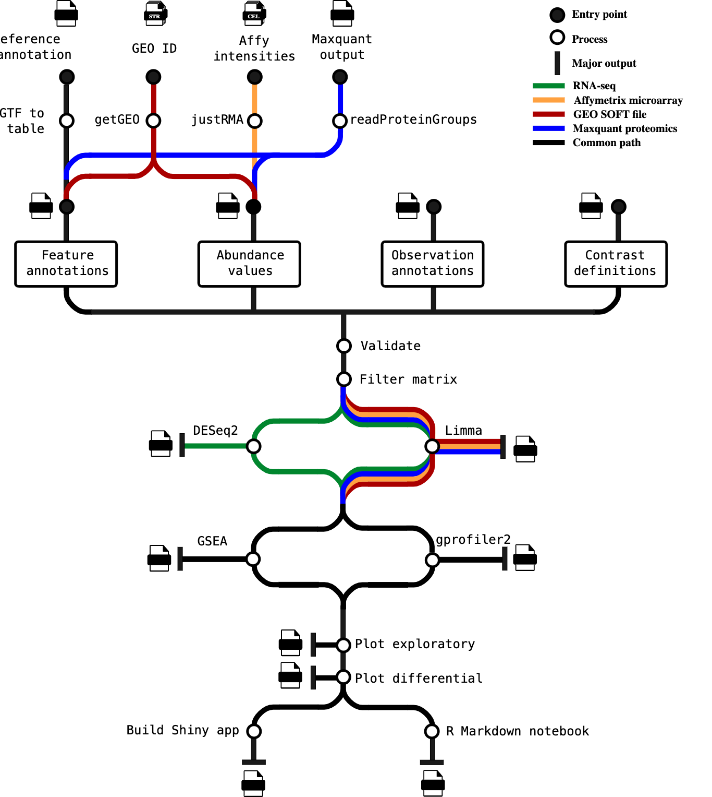

#  

[](https://nf-co.re/differentialabundance/results)[](https://doi.org/10.5281/zenodo.7568000)

[](https://www.nextflow.io/)
[](https://docs.conda.io/en/latest/)
[](https://www.docker.com/)
[](https://sylabs.io/docs/)
[](https://tower.nf/launch?pipeline=https://github.com/nf-core/differentialabundance)

[](https://nfcore.slack.com/channels/differentialabundance)[](https://twitter.com/nf_core)[](https://www.youtube.com/c/nf-core)

## Introduction

**nf-core/differentialabundance** is a bioinformatics pipeline that can be used to analyse data represented as matrices, comparing groups of observations to generate differential statistics and downstream analyses. The initial feature set is built around RNA-seq, but we anticipate rapid expansion to include other platforms.

The pipeline is built using [Nextflow](https://www.nextflow.io), a workflow tool to run tasks across multiple compute infrastructures in a very portable manner. It uses Docker/Singularity containers making installation trivial and results highly reproducible. The [Nextflow DSL2](https://www.nextflow.io/docs/latest/dsl2.html) implementation of this pipeline uses one container per process which makes it much easier to maintain and update software dependencies. Where possible, these processes have been submitted to and installed from [nf-core/modules](https://github.com/nf-core/modules) in order to make them available to all nf-core pipelines, and to everyone within the Nextflow community!

On release, automated continuous integration tests run the pipeline on a full-sized dataset on the AWS cloud infrastructure. This ensures that the pipeline runs on AWS, has sensible resource allocation defaults set to run on real-world datasets, and permits the persistent storage of results to benchmark between pipeline releases and other analysis sources.The results obtained from the full-sized test can be viewed on the [nf-core website](https://nf-co.re/differentialabundance/results).

## Pipeline summary



1. Optionally generate a list of genomic feature annotations using the input GTF file (if a table is not explicitly supplied).
2. Cross-check matrices, sample annotations, feature set and contrasts to ensure consistency.
3. Run differential analysis over all contrasts specified.
4. Optionally run a differential gene set analysis.
5. Generate exploratory and differential analysis plots for interpretation.
6. Optionally build and (if specified) deploy a Shiny app for fully interactive mining of results.
7. Build an HTML report based on R markdown, with interactive plots (where possible) and tables.

## Quick Start

1. Install [`Nextflow`](https://www.nextflow.io/docs/latest/getstarted.html#installation) (`>=22.10.1`)

2. Install any of [`Docker`](https://docs.docker.com/engine/installation/), [`Singularity`](https://www.sylabs.io/guides/3.0/user-guide/) (you can follow [this tutorial](https://singularity-tutorial.github.io/01-installation/)), [`Podman`](https://podman.io/), [`Shifter`](https://nersc.gitlab.io/development/shifter/how-to-use/) or [`Charliecloud`](https://hpc.github.io/charliecloud/) for full pipeline reproducibility _(you can use [`Conda`](https://conda.io/miniconda.html) both to install Nextflow itself and also to manage software within pipelines. Please only use it within pipelines as a last resort; see [docs](https://nf-co.re/usage/configuration#basic-configuration-profiles))_.

3. Download the pipeline and test it on a minimal dataset with a single command:

   ```bash
   nextflow run nf-core/differentialabundance -profile test,YOURPROFILE --outdir <OUTDIR>
   ```

   Note that some form of configuration will be needed so that Nextflow knows how to fetch the required software. This is usually done in the form of a config profile (`YOURPROFILE` in the example command above). You can chain multiple config profiles in a comma-separated string.

   > - The pipeline comes with config profiles called `docker`, `singularity`, `podman`, `shifter`, `charliecloud` and `conda` which instruct the pipeline to use the named tool for software management. For example, `-profile test,docker`.
   > - Please check [nf-core/configs](https://github.com/nf-core/configs#documentation) to see if a custom config file to run nf-core pipelines already exists for your Institute. If so, you can simply use `-profile <institute>` in your command. This will enable either `docker` or `singularity` and set the appropriate execution settings for your local compute environment.
   > - If you are using `singularity`, please use the [`nf-core download`](https://nf-co.re/tools/#downloading-pipelines-for-offline-use) command to download images first, before running the pipeline. Setting the [`NXF_SINGULARITY_CACHEDIR` or `singularity.cacheDir`](https://www.nextflow.io/docs/latest/singularity.html?#singularity-docker-hub) Nextflow options enables you to store and re-use the images from a central location for future pipeline runs.
   > - If you are using `conda`, it is highly recommended to use the [`NXF_CONDA_CACHEDIR` or `conda.cacheDir`](https://www.nextflow.io/docs/latest/conda.html) settings to store the environments in a central location for future pipeline runs.

4. Start running your own analysis!

RNA-seq:

```bash
 nextflow run nf-core/differentialabundance \
     --input samplesheet.csv \
     --contrasts contrasts.csv \
     --matrix assay_matrix.tsv \
     --gtf mouse.gtf \
     --outdir <OUTDIR>  \
     -profile rnaseq,<docker/singularity/podman/shifter/charliecloud/conda/institute>
```

Affymetrix microarray:

```bash
 nextflow run nf-core/differentialabundance \
     --input samplesheet.csv \
     --contrasts contrasts.csv \
     --affy_cel_files_archive cel_files.tar \
     --outdir <OUTDIR>  \
     -profile affy,<docker/singularity/podman/shifter/charliecloud/conda/institute>
```

### Reporting

The pipeline reports its outcomes in two forms: a static report built from an R markdown document, and optionally a Shiny app:

 

 

 


## Documentation

The nf-core/differentialabundance pipeline comes with documentation about the pipeline [usage](https://nf-co.re/differentialabundance/usage), [parameters](https://nf-co.re/differentialabundance/parameters) and [output](https://nf-co.re/differentialabundance/output).

## Credits

nf-core/differentialabundance was originally written by Jonathan Manning ([@pinin4fjords](https://github.com/pinin4fjords)) and Oskar Wacker ([@WackerO](https://github.com/WackerO)). Jonathan Manning is an employee of Healx, an AI-powered, patient-inspired tech company, accelerating the discovery and development of treatments for rare diseases. We are grateful for their support of open science in this project.

We thank the many members of the nf-core community who assisted with this pipeline, often by reviewing module pull requests including but not limited to:

- [@ggabernet](https://github.com/ggabernet),
- [@SPPearce](https://github.com/SPPearce),
- [@nvnieuwk](https://github.com/nvnieuwk),
- [@jfy133](https://github.com/jfy133),
- [@mahesh-panchal](https://github.com/mahesh-panchal),
- [@mashehu](https://github.com/mashehu),
- [@apeltzer](https://github.com/apeltzer)

## Contributions and Support

If you would like to contribute to this pipeline, please see the [contributing guidelines](.github/CONTRIBUTING.md).

For further information or help, don't hesitate to get in touch on the [Slack `#differentialabundance` channel](https://nfcore.slack.com/channels/differentialabundance) (you can join with [this invite](https://nf-co.re/join/slack)).

## Citations

If you use nf-core/differentialabundance for your analysis, please cite it using the following doi: [10.5281/zenodo.7568000](https://doi.org/10.5281/zenodo.7568000).

An extensive list of references for the tools used by the pipeline can be found in the [`CITATIONS.md`](CITATIONS.md) file.

This pipeline uses code and infrastructure developed and maintained by the [nf-core](https://nf-co.re) community, reused here under the [MIT license](https://github.com/nf-core/tools/blob/master/LICENSE).

You can cite the `nf-core` publication as follows:

> **The nf-core framework for community-curated bioinformatics pipelines.**
>
> Philip Ewels, Alexander Peltzer, Sven Fillinger, Harshil Patel, Johannes Alneberg, Andreas Wilm, Maxime Ulysse Garcia, Paolo Di Tommaso & Sven Nahnsen.
>
> _Nat Biotechnol._ 2020 Feb 13. doi: [10.1038/s41587-020-0439-x](https://dx.doi.org/10.1038/s41587-020-0439-x).
